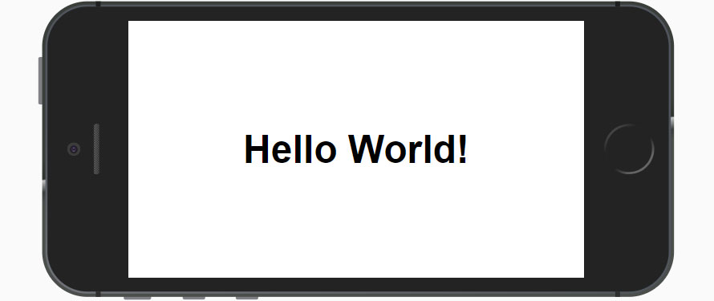

# Hello PWA
The classic Hello World program as a Progressive Web App

## What It Is

A simple PWA demo that displays the text "Hello, World!" utilizing an app manifest, service workers and caching. This demo is written in plain-vanilla HTML, CSS and Javascript (ES6). It has no dependancies.

## Demo

https://jamesjohnson280.github.io/Hello-PWA/

## Browser Compatibility

Hello PWA has been tested in the following browsers:

* Chrome 67 (Windows and Android)
* Firefox 60
* Safari 11
* Edge 42